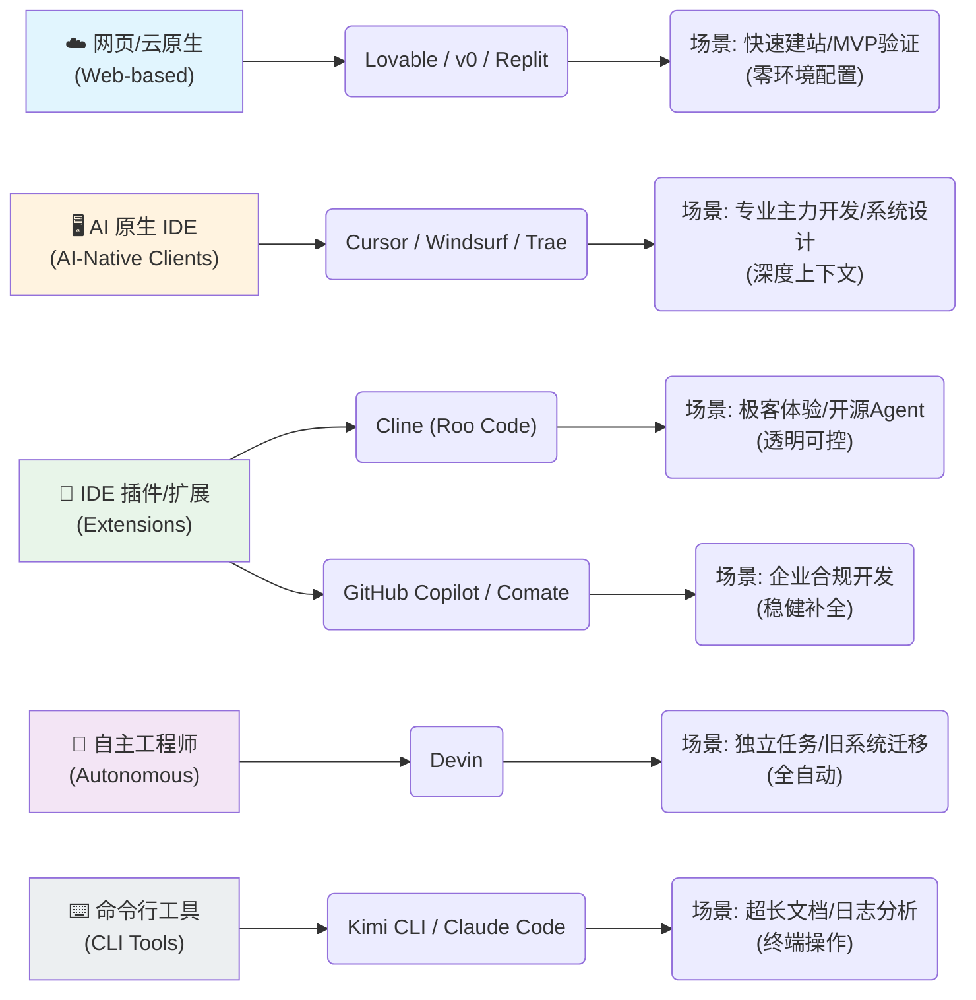

这篇博客是我想尝试一下如何以项目经理的视角来分析一个AI产品。这之后或许将成为一个合集，这次我会最开始以Vibe coding为例，来分析一下市场上的code 工具的优劣和受众。

# 什么是 Vibe Coding？
传统的 coding，是一个清晰但繁琐的过程： 

>想法 → 需求拆解 → 代码编写 → 环境配置 → 调试 → 修复 Bug → 构建 → 部署 → 交付

这其中每一步都要靠人亲手完成，实际上可能80% 的精力其实在写“中间过程”，而不是在解决真正的问题。

Vibe coding（氛围编程）是一种人工智能辅助的软件开发技术，开发人员使用自然语言指导人工智能构建什么，而不是逐行编写传统代码。 该过程由 Andrej Karpathy 于 2025 年初推广，涉及通过对话方式引导 AI 生成、完善和调试代码，从而实现更快的开发并使编码经验有限的人更容易使用。这些工具不再要求“一行行写代码”，而是强调一种新的协作方式：**告诉 AI 你想做什么，AI 反向推导并帮你完成代码和实现。**  

AI 会在这个过程中负责：生成代码，分析整个项目，修改多文件，运行命令，修 bug，生成 UI，写文档，甚至自己部署。**而用户的角色，则转变成了一个真正的“产品决策者 + 审阅者 + 监督者”。**

一言以蔽之：**vibe coding = 意图驱动开发 + AI 自动化实现。**


vibe coding 不会完全取代程序员，但是它会改变程序员的工作方式。

因此未来开发者的价值在于：

- 能否清晰表达需求
- 能否设计合理的结构
- 能否评估方案的可行性
- 能否验证和把控 AI 产出的质量


每个程序员都会变成一个更强的“系统设计者”，而不擅长编码的人，这从某一种方面来说是降低了程序员这个职业的门槛，但从另一方面来说，却也促使高级程序员往系统决策，项目规划的方向发展，而不仅仅只停留在完成需求的阶段。


# 市场分析  
现在市场上有非常多的AI辅助编程的产品，市场研究显示，AI 辅助编码（包含 vibe coding）目前规模在 几十亿美元级别。例如，根据一份报告[mktclarity](https://mktclarity.com/blogs/news/vibe-coding-market?utm_source=chatgpt.com),
2025 年 AI 编码工具市场规模在约 US $6-12 billion 之间。


vibe coding 市场绝非小规模“工具增量”，而是一个正在被快速塑造、潜在巨大、竞争激烈的新赛道。


为什么大模型在编程领域落地最快？ 从底层逻辑看，代码是高结构化、语法有限且逻辑严密的文本数据。大模型通过学习海量 GitHub 代码，天生具备了极强的结构理解力。

但以 PM 的视角来看，市面上眼花缭乱的 Vibe Coding 产品（如 Cursor, Windsurf, Devin 等），其核心技术壁垒并非仅仅在于模型本身，而在于工程化能力：

- 上下文构建（Context Management）： 如何将整个项目、文档、依赖关系高效地“喂”给模型？

- 工具链调用（Function Calling）： 如何精准地让 AI 执行终端命令、文件读写和部署操作？

许多看似神秘的产品，本质上是**“优秀的 Prompt 工程 + 高效的上下文索引机制 + 自动化工具链”的组合。这意味着，单纯的技术门槛正在快速下降，产品的易用性和交互体验**将成为决胜关键。

并且，从产品角度来看，虽然一些公司估值已高，但大量工具仍处于拓用户阶段，但如何把“免费用户”转为“付费企业客户”是关键，很多产品没法产生用户黏性，最终也胎死腹中。

另一方面，不少vibe coding 工具背后使用的大模型、推理资源、集成工具链等其实都是第三方的产品，如何通过大规模用户量来降低成本，是每个产品都需要考虑的问题。最后尤其是国内合规市场，对数据安全、模型安全、可控可审非常看重，合规问题也是每个产品都需要考虑的问题。

# 产品介绍 
现在进入正题，我将介绍几款现在市场上比较热门的vibe coding产品，并从分析它们的核心竞争力和针对的目标用户群体。

## 网页端
Web 平台的产品能够浏览器里直接 vibe coding，一部分甚至可以进行部署，此类产品适合快速建站、MVP验证等场景。 

### YouWare
定位：「世界上第一个 vibe coding 社区」——更偏创作者& 半技术人，用语音/自然语言快速生成网站和 App.[youware](https://www.youware.com/)

特点：

- 从 prompt 或语音描述生成 HTML/CSS/JS 页面，可一键上线。
- 强社区属性，有大量别人做好的项目可以 remix，类似 “TikTok + GitHub”。
- 明确打出「vibe coding」概念，把编码体验做成「滑动刷创意、点一点就上线」。

适用场景：
- 运营、市场、内容创作者快速做活动页、个人主页、简单工具.



价格：有 免费层，新用户默认有500credits.

### Replit
**定位：**在线 IDE + AI Agent，「一个浏览器 tab = 开发机 + CI + 部署平台」。 [replit](https://replit.com/)



特点：

- Replit Agent 可以从一句话开始全程搭项目、并且直接一键部署上线。
- 和传统 Ghostwriter 的「补全」不同，replit agent会跑测试、开浏览器检查页面。

适用场景：

- 没本地开发环境的学生 / 初学者。
- 想做「一键分享可运行 demo」的黑客松/教学场景。

### v0.dev
定位：**AI 生成 React + Tailwind UI 的前端利器，本质上更像一个「Prompt-to-UI 设计工具」。** [v0.dev](https://v0.dev/)

特点：

- 输入自然语言描述，例如「带侧边栏和图表的仪表盘」，直接吐出高质量 React 组件。
- 和 Vercel / Next.js 生态强绑定，一键部署到生产。
- 最新版本强调「agentic」，不只是 UI，还会规划数据源、逻辑和部署链路。

适用场景：  

- 设计+工程混合角色：快速从 idea 到可跑的 demo。

可以利用v0 来做一个非常美观和动态感的dashboard界面。


### lovable
定位：**从一句话 prompt → 完整 SaaS / Web App，主打「给非程序员用的 app builder」。** [lovable](https://lovable.dev/)

特点：

- 直接生成多页面应用：路由、表单、认证、数据库集成都能生成。
- 和 v0、Cursor 等相比，Lovable 更偏「帮你把产品起盘」。

适用场景：

- 想快速验证商业想法的创业者/产品。
- 不想管 infra，只想看到「能跑起来的产品」。

## IDE 插件/扩展端

